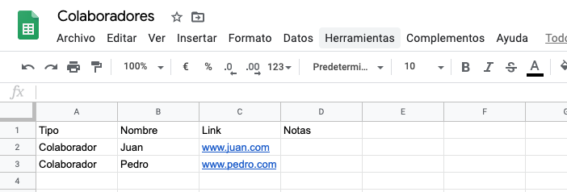
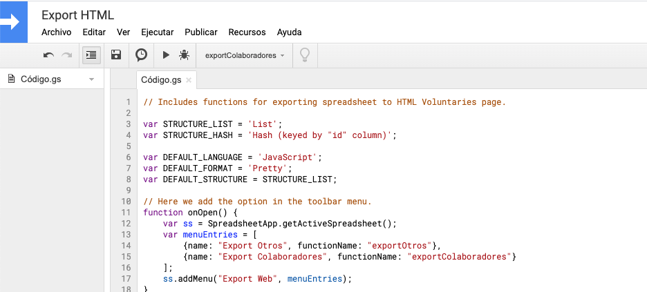
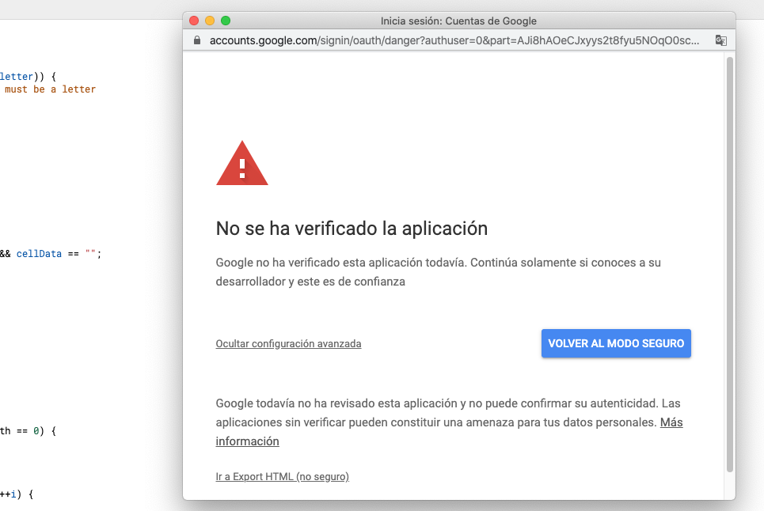
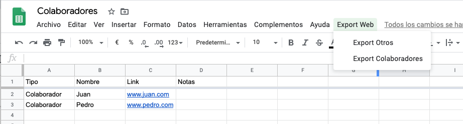

# google-spreadsheets-to-html
En ocasiones necesitamos mantener un listado de links o contactos en una hoja para poder exportarlo a html y dejarlo publico en una web. 

En este ejemplo podemos ver cómo usar una spreadsheets de google drive para mantener de forma sencilla links y con ello generar código html. 

Usando el código export-to-html-code.js es muy sencillo y con unos pequeños cambios puedes adaptarlo a tus necesidades. 

## El problema
Tenemos un listado de colaboradores y quiero tener una página de agradecimientos. 

Primero creo una hoja en drive. 


Y necesitamos generar código hml con la lista de los colboradores.

```
<ul>
<li><a href="www.juan.com" target="_blank">Juan</a></li>
<li><a href="www.pedro.com" target="_blank">Pedro</a></li>
</ul>
```

## La solución
Añadir el script export-to-html-code.js a la hoja.

Pasos:
* En el menú pulsar en "Herramientas/Editor de secuencia de comandos".
* Copia y pega el código.
  
* Guarda y refresca la hoja. 
* Mostrará un mensaje de seguridad, para poder continuar has de aceptarlo.
  
* Ahora verás un nuevo menú con las dos opciones que hemos configurado.
  


# Referencias
* Basado en: http://blog.pamelafox.org/2013/06/exporting-google-spreadsheet-as-json.html
* https://developers.google.com/apps-script/guides/clasp

